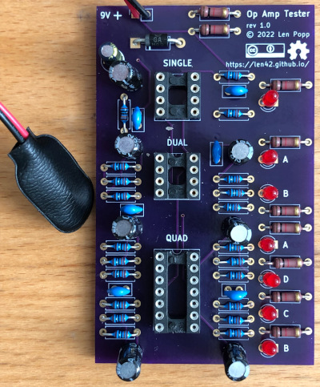

# Op Amp Tester

This is a circuit that tests op amp chips to verify that they are working properly. You might find it useful if you repair old equipment, or if your prototype circuits don't always work the way you expect. 🔥😕

### Features

- Tests single, dual, and quad op amp chips that have the standard DIP pinout
- LEDs blinking = op amps working!
- Powered by a 9-volt battery

### Usage

The circuit board has separate sockets for single, dual, and quad op amp chips. To test a chip, insert it in the appropriate socket and plug in a 9-volt battery. The LED(s) next to the chip should start blinking. If one or more of the LEDs don't blink, the chip is bad.

### Notes

This circuit should work with just about any DIP op amp IC (single, dual, or quad) that can operate on a 9 volt power supply and that has the usual pinout. I have tried it with several chips including:
- TL071, TL074
- LM358
- OPA2134

The PCB layout is provided in KiCad and gerber formats. (TBD) The PCBs that I used can be ordered from OSH Park. The design is [here.](https://oshpark.com/shared_projects/zzz)

I have provided a [parts](OpAmpTester-BOM.csv) list with links to specific parts and vendors, but most of the components are generic resistors, capacitors, and LEDs - it's not necessary to use the exact parts that I listed. I do recommend using good quality IC sockets because cheap ones are not designed for repeated IC insertion and removal.

Please note that I am a hobbyist, not a trained electronics engineer. No guarantees!

### References

This design is based on some other op amp testers that I found:

- [Edison Science Corner](https://www.youtube.com/watch?v=aGswFkS5oHQ)  
- [NightFire Electronics](https://vakits.com/single-op-amp-tester-kit)  
- [Synthchaser](https://synthchaser.com/product/synthchaser-op-amp-tester/)  

### Software Used

[KiCad](https://www.kicad.org/) 6.0.4

 © 2022 Len Popp CC BY This work is licensed under a <a rel="license" href="http://creativecommons.org/licenses/by/4.0/">Creative Commons Attribution 4.0 International License</a>.

